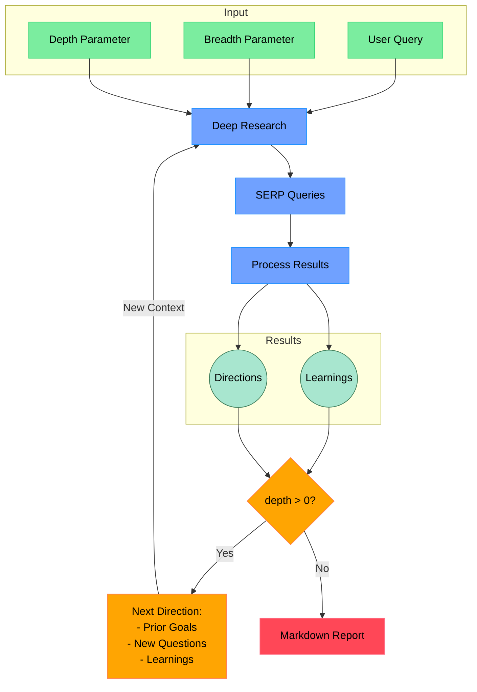
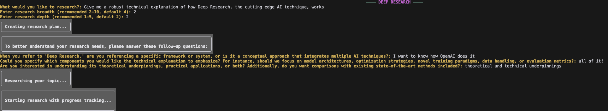

# Python Port of deep-research

**Note:** This project is an extension of the excellent work done by [@korykilpatrick/deep-research](https://github.com/korykilpatrick/deep-research). All core functionality from the original TypeScript repository [@dzhng/deep-research](https://github.com/dzhng/deep-research) has been preserved, with some additional user-friendly enhancements for Python developers. Full credit for the original design and architecture goes to the original author.

If you find this Python version useful, please consider starring both this repository and the original.

Reach out to me on [X/Twitter](https://x.com/Jordan026791657) if you have any questions or are using this to build something cool!

## Deep Research

Perform iterative research on any topic using Firecrawl for web scraping and OpenAI for 
LLM-driven query generation.

## How It Works



## Features

- **Iterative Research**: Performs deep research by iteratively generating search queries, processing results, and diving deeper based on findings
- **Intelligent Query Generation**: Uses LLMs to generate targeted search queries based on research goals and previous findings
- **Depth & Breadth Control**: Configurable parameters to control how wide (breadth) and deep (depth) the research goes
- **Smart Follow-up**: Generates follow-up questions to better understand research needs
- **Comprehensive Reports**: Produces detailed markdown reports with findings and sources
- **Concurrent Processing**: Handles multiple searches and result processing in parallel for efficiency

## Requirements
- **Python** >= 3.9
- **OpenAI and/or Anthropic** API key in `.env` (`OPENAI_KEY` and/or `ANTHROPIC_KEY`)
- **Firecrawl** API key in `.env` (`FIRECRAWL_KEY`)

## Virtual Environment Setup

It is recommended to use a Python virtual environment to isolate project dependencies. To set one up, run:

```bash
python -m venv venv
source venv/bin/activate
```

Then proceed with the installation steps below.

## Installation
1. Clone this repo.
2. Rename `.env.example` to `.env` and insert valid API keys.
3. Run `pip install -r requirements.txt`.

## Testing
- run `pytest` to ensure you have everything wired up correctly.

## Usage

### Command Line Interface

Run the research assistant:

```bash
python src/run.py
```

You'll be prompted to:

1. Enter your research query
2. Specify research breadth (recommended: 3-10, default: 4)
3. Specify research depth (recommended: 1-5, default: 2)
4. Answer follow-up questions to refine the research direction

The system will then:

1. Generate and execute search queries
2. Process and analyze search results
3. Recursively explore deeper based on findings
4. Generate a comprehensive markdown report

The final report will be saved as `output.md` in your working directory.

### REST API

The project also includes a FastAPI-based REST API that provides the same functionality:

```bash
python src/api.py
```

This will start the API server at http://localhost:8001. You can access the interactive API documentation at http://localhost:8001/docs or the detailed API documentation at http://localhost:8001/docs/api.

#### API Endpoints

1. **Initialize Research Session**
   - **URL**: `/research/start`
   - **Method**: `POST`
   - **Request Body**:
     ```json
     {
       "user_id": "your-user-id",
       "prompt": "Your research topic",
       "breadth": 4,  // Optional, default is 4
       "depth": 2,    // Optional, default is 2
       "model": "o3-mini", // Optional, default depends on environment
       "model_params": {} // Optional, model-specific parameters
     }
     ```
   - **Response (with follow-up questions)**:
     ```json
     {
       "job_id": "unique-uuid",
       "status": "pending_answers",
       "questions": ["Question 1", "Question 2", "Question 3"]
     }
     ```
   - **Response (with no follow-up questions)**:
     ```json
     {
       "job_id": "unique-uuid",
       "status": "running",
       "questions": []
     }
     ```

2. **Submit Answers to Follow-up Questions**
   - **URL**: `/research/answer`
   - **Method**: `POST`
   - **Request Body**:
     ```json
     {
       "user_id": "your-user-id",
       "job_id": "unique-uuid",
       "answers": ["Answer 1", "Answer 2", "Answer 3"]
     }
     ```
   - **Response**:
     ```json
     {
       "status": "running"
     }
     ```

3. **Check Research Status**
   - **URL**: `/research/status`
   - **Method**: `GET`
   - **Query Parameters**: `user_id`, `job_id`
   - **Response (in progress)**:
     ```json
     {
       "status": "running"
     }
     ```
   - **Response (completed)**:
     ```json
     {
       "status": "completed",
       "results": {
         "prompt": "Combined query with answers",
         "report": "Markdown report content",
         "sources": ["URL 1", "URL 2", "..."]
       }
     }
     ```

4. **Cancel Research**
   - **URL**: `/research/cancel`
   - **Method**: `GET`
   - **Query Parameters**: `user_id`, `job_id`
   - **Response**:
     ```json
     {
       "status": "cancelled"
     }
     ```

5. **List Research Sessions**
   - **URL**: `/research/list`
   - **Method**: `GET`
   - **Query Parameters**: `user_id`
   - **Response**:
     ```json
     {
       "sessions": [
         {
           "job_id": "unique-uuid-1",
           "status": "completed"
         },
         {
           "job_id": "unique-uuid-2",
           "status": "running"
         }
       ]
     }
     ```

Sessions are cached for 4 hours before being automatically removed.

## Docker
1. Build with `docker build -t deep-research-api .`
2. Run with `docker-compose up`

## Example

Here's what the research assistant looks like in action:



The output generated from this example can be found in [docs/output-example.md](docs/output-example.md).

## Concurrency

If you have a paid version of Firecrawl or a local version, feel free to increase the `CONCURRENCY_LIMIT` in `.env` so it runs a lot faster.

If you have a free version, you may sometimes run into rate limit errors. You can reduce the `CONCURRENCY_LIMIT` to 1, but it will run a lot slower.

## Custom endpoints and models

There are 2 other optional env vars that lets you tweak the endpoint (for other OpenAI compatible APIs like OpenRouter or Gemini) as well as the model string. By default, `o3-mini` is used.

```bash
OPENAI_ENDPOINT="custom_endpoint"
OPENAI_MODEL="custom_model"
```

## How It Works

1. **Initial Setup**

   - Takes user query and research parameters (breadth & depth)
   - Generates follow-up questions to understand research needs better

2. **Deep Research Process**

   - Generates multiple SERP queries based on research goals
   - Processes search results to extract key learnings
   - Generates follow-up research directions

3. **Recursive Exploration**

   - If depth > 0, takes new research directions and continues exploration
   - Each iteration builds on previous learnings
   - Maintains context of research goals and findings

4. **Report Generation**
   - Compiles all findings into a comprehensive markdown report
   - Includes all sources and references
   - Organizes information in a clear, readable format

## License

MIT License - feel free to use and modify as needed.