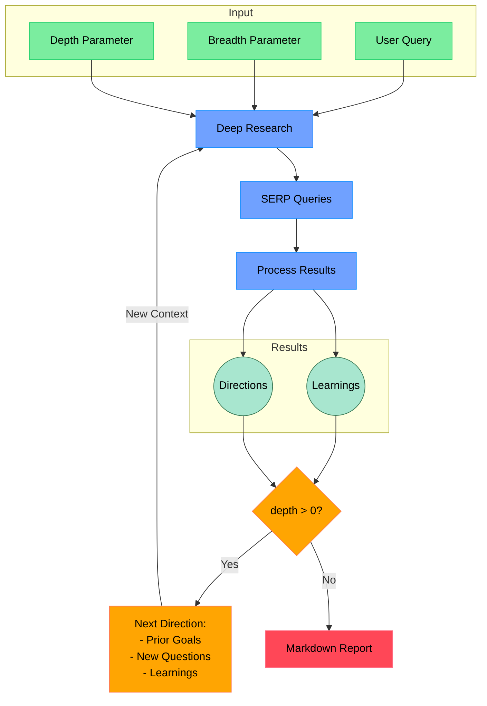

# Deep Research

**Note:** This project started as a mirror of [@dzhng/deep-research](https://github.com/dzhng/deep-research). He deserves most of the credit!

Perform iterative research on any topic using Firecrawl for web scraping and OpenAI for LLM-driven query generation.

## How It Works



## Features

- **Iterative Research**: Performs deep research by iteratively generating search queries, processing results, and diving deeper based on findings
- **Intelligent Query Generation**: Uses LLMs to generate targeted search queries based on research goals and previous findings
- **Depth & Breadth Control**: Configurable parameters to control how wide (breadth) and deep (depth) the research goes
- **Smart Follow-up**: Generates follow-up questions to better understand research needs
- **Comprehensive Reports**: Produces detailed markdown reports with findings and sources
- **Concurrent Processing**: Handles multiple searches and result processing in parallel for efficiency

## Requirements
- **Python** 3.11+ (Untested on earlier versions)
- **OpenAI** API key in `.env` (`OPENAI_KEY`)
- **Firecrawl** API key in `.env` (`FIRECRAWL_KEY`)
- **OPENAI_MODEL** (optional): Specifies the OpenAI model to be used for AI-powered functionalities. Defaults to `o3-mini`.

## Virtual Environment Setup

It is recommended to use a Python virtual environment to isolate project dependencies. To set one up, run:

```bash
python -m venv venv
source venv/bin/activate
```

Then proceed with the installation steps below.

## Installation
1. Clone this repo.
2. Rename `.env.example` to `.env` and insert valid API keys.
3. Run `pip install -r requirements.txt`.

## Usage

Run the research assistant:

```bash
python src/run.py
```

You'll be prompted to:

1. Enter your research query
2. Specify research breadth (recommended: 3-10, default: 4)
3. Specify research depth (recommended: 1-5, default: 2)
4. Answer follow-up questions to refine the research direction

The system will then:

1. Generate and execute search queries
2. Process and analyze search results
3. Recursively explore deeper based on findings
4. Generate a comprehensive markdown report

The final report will be saved as `output.md` in your working directory.

## Testing
- `pytest` runs some basic tests to ensure you have everything wired up correctly.

## Docker
1. Build with `docker build -t deep-research .`
2. Run with `docker-compose up`

### Concurrency

If you have a paid version of Firecrawl or a local version, feel free to increase the `CONCURRENCY_LIMIT` in `.env` so it runs a lot faster.

If you have a free version, you may sometimes run into rate limit errors. You can reduce the `CONCURRENCY_LIMIT` to 1, but it will run a lot slower.


## How It Works

1. **Initial Setup**

   - Takes user query and research parameters (breadth & depth)
   - Generates follow-up questions to understand research needs better

2. **Deep Research Process**

   - Generates multiple SERP queries based on research goals
   - Processes search results to extract key learnings
   - Generates follow-up research directions

3. **Recursive Exploration**

   - If depth > 0, takes new research directions and continues exploration
   - Each iteration builds on previous learnings
   - Maintains context of research goals and findings

4. **Report Generation**
   - Compiles all findings into a comprehensive markdown report
   - Includes all sources and references
   - Organizes information in a clear, readable format

## License

MIT License - feel free to use and modify as needed.